## Olá! 👋 {.smaller}

```{r}
#| label: setup
#| include: false

library(here)

source(here("R", "_setup.R"))
```

::::: {.columns}
:::: {.column style="width: 55%; font-size: 0.75em;"}
Esta apresentação trata sobre o uso de Modelos Baseados em Agentes (ABMs) e mostra como eles representam **uma ferramenta capaz de integrar diferentes perspectivas** na modelagem de sistemas complexos e de analisar de forma conjunta os efeitos das mudanças climáticas.

::: {style="padding-top: 15px;"}
Aqui estão os tópicos principais:

1. **Modelos Baseados em Agentes**
1. **LogoClim: WorldClim no NetLogo**
1. **Logônia: Um Exemplo de Aplicação**
1. **Sindemia Global**
1. **Conclusão**
:::
::::
:::: {.column style="width: 45%; text-align: center"}
{style="width: 55%;"}

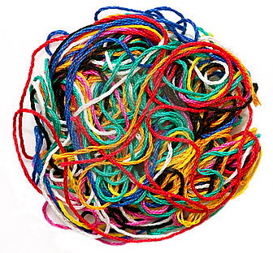{style="width: 65%; margin-top: -25px;"}
::::
:::::

::: {.notes}
II Reunião de Perspectivas Multidisciplinares sobre Mudanças Climáticas
:::

::: footer
(Ilustração de [Allison Horst](https://twitter.com/allison_horst))
:::

::: {.notes}
:::

## Modelos Baseados em Agentes {.smaller}

::::: {.columns}
:::: {.column style="width: 47.5%; font-size: 0.725em;"}
Modelos baseados em agentes (ABMs) são **modelos computacionais** usados para simular o comportamento de agentes e suas interações, permitindo estudar **fenômenos emergentes**.

Em vez de descrever um sistema apenas com variáveis que representam o estado do sistema como um todo (**abordagem global**/de cima pra baixo), modelamos seus agentes individuais (**abordagem local**/de baixo pra cima) [@railsback2019].

Agentes frequentemente representam pessoas ou outros animais, mas **agentes também podem representar qualquer coisa**, desde células biológicas até empresas econômicas ou municípios políticos [@smaldino2023a].
:::
:::: {.column style="width: 5%;"}
::::
:::: {.column style="width: 47.5%;"}
::: {layout-nrow=2 style="padding-top: 25px"}
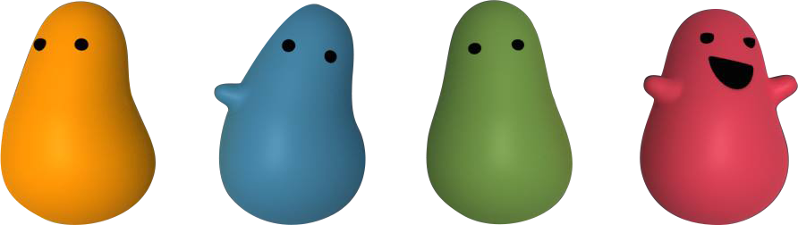{fig-align="center"}

{fig-align="center"}
:::
::::
:::::

::: footer
(Imagem e vídeo de [Primer](https://www.youtube.com/watch?v=YNMkADpvO4w))
:::

::: {.notes}
:::

## NetLogo {.smaller}

:::: {.columns}
::: {.column .center style="width: 55%; padding-top: 0px;"}
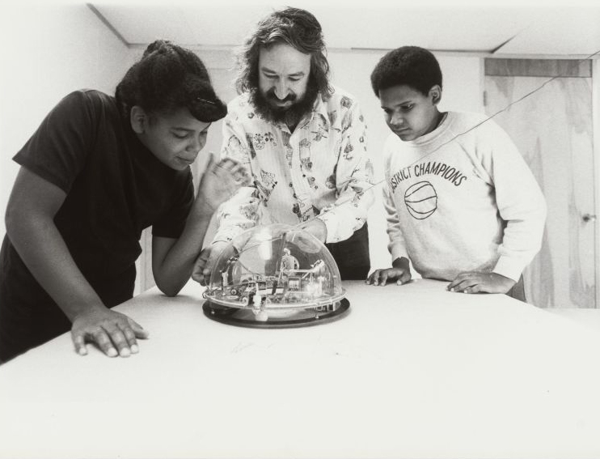{fig-align="center" style="width: 100%;"}

[{fig-align="center" style="width: 80%; margin-top: -1em"}](https://www.netlogo.org/)
:::
::: {.column style="width: 45%; padding-top: 0px;"}
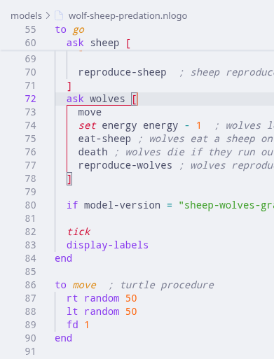{fig-align="center" style="width: 90%;"}
:::
::::

::: footer
(Foto de [MIT Museum](https://mitmuseum.mit.edu/collections/object/GCP-00019361))
:::

::: {.notes}
:::

## Modelagem Orient. a Padrões {.smaller}

**Um padrão é qualquer coisa além da variação aleatória**.

Podemos pensar em padrões como regularidades, sinais.

:::: {.columns}
::: {.column .center style="width: 50%; padding-top: 30px;"}
{fig-align="center" style="width: 90%;"}
:::
::: {.column style="width: 50%; padding-top: 30px;"}
{fig-align="center" style="width: 90%;"}
:::
::::

::: {style="font-size: 0.65em; padding-left: 30px; padding-right: 30px; margin-top: -30px" .brand-gray}
**Alinhamento**: Um pássaro tende a se mover na mesma direção que os pássaros próximos.

**Separação**: Um pássaro vai se afastar para evitar outro pássaro que se aproxime demais.

**Coesão**: Um pássaro se moverá em direção a outros pássaros próximos (a menos que outro pássaro esteja muito próximo).

:::

::: footer
(Vídeo de National Geographic | Modelo de @wilensky1998, baseado em @reynolds1987)
:::

::: {.notes}
:::

## Exemplos {.smaller}

:::: {.columns}
::: {.column style="width: 50%; font-size: 0.75em;"}
**Ecologia**`<br>`{=html}[Presa-Predador](https://pt.wikipedia.org/wiki/Equa%C3%A7%C3%A3o_de_Lotka-Volterra) [@lotka1925; @volterra1926]

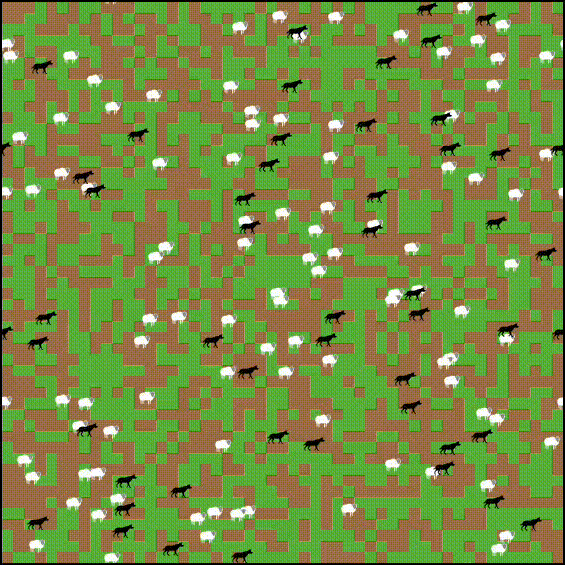{fig-align="center" style="width: 90%;"}
:::
::: {.column style="width: 50%; font-size: 0.75em;"}
**Epidemiologia**`<br>`{=html}[Epidemia (SIR)](https://pt.wikipedia.org/wiki/Modelo_epid%C3%AAmico#O_Modelo_SIR) [@kermack1927]

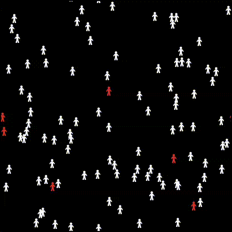{fig-align="center" style="width: 90%;"}
:::
::::

::: footer
(Modelos de @wilensky1997 e @yang2011)
:::

::: {.notes}
:::

## Exemplos {.smaller}

:::: {.columns}
::: {.column style="width: 50%; font-size: 0.75em;"}
**Física`<br>`{=html}[Figuras de Chladni](https://pt.wikipedia.org/wiki/Figura_de_Chladni)** [@chladni1787]

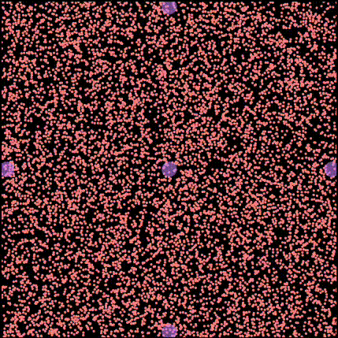{fig-align="center" style="width: 90%;"}
:::
::: {.column style="width: 50%; font-size: 0.75em;"}
**Psicologia Evolutiva**`<br>`{=html}Altruísmo [@lehmann2006]

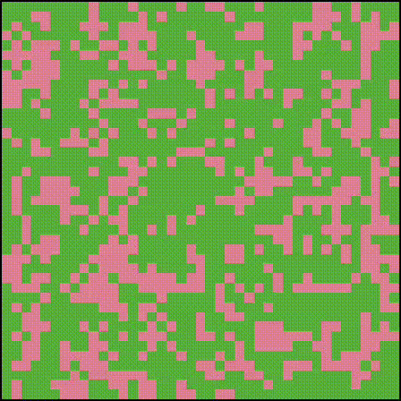{fig-align="center" style="width: 90%;"}
:::
::::

::: {.notes}
:::

::: footer
(Modelos de @brown2025 e @wilensky1998a)
:::

## Exemplos {.smaller}

:::: {.columns}
::: {.column style="width: 50%; font-size: 0.75em;"}
**Sociologia**`<br>`{=html}[Segregação](https://en.wikipedia.org/wiki/Schelling%27s_model_of_segregation) [@schelling1971]

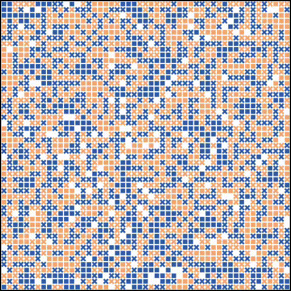{fig-align="center" style="width: 90%;"}
:::
::: {.column style="width: 50%; font-size: 0.75em;"}
**Ciências Ambientais**`<br>`{=html}[Incêndios Florestais](https://pt.wikipedia.org/wiki/Inc%C3%AAndio_de_vegeta%C3%A7%C3%A3o)

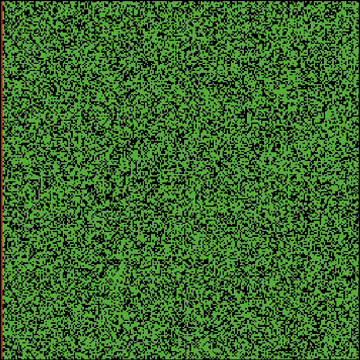{fig-align="center" style="width: 90%;"}
:::
::::

::: {.notes}
:::

::: footer
(Modelo de @wilensky1997a e @wilensky1997b)
:::

## Exemplos {.smaller }

::: {.column style="font-size: 0.75em;"}
[**Agentes Generativos**](https://en.wikipedia.org/wiki/Schelling%27s_model_of_segregation)
:::

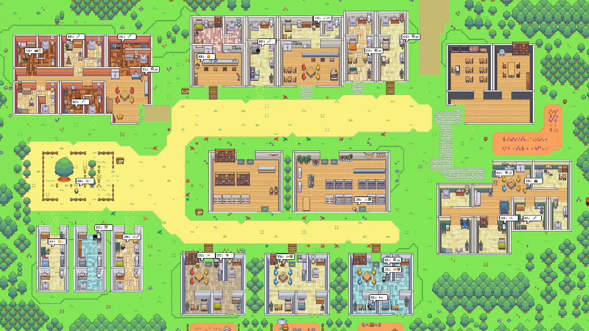{fig-align="center" style="width: 100%;"}

::: {.notes}
:::

::: footer
(Modelo de @park2023)
:::

## Usos de ABMs {.smaller}

Desenvolvimento e **corroboração** de teorias.

**Exploração** de cenários e pontos de alavanca.

**Previsão** de cenários futuros (apenas para modelos empíricos)

::: {.brand-red style="font-weight: bold; text-align: center; padding-top: 1em; padding-bottom: 1em;"}
Dada às condições da sua teoria ou hipótese, é possível [replicar]{.brand-green} o fenômeno e seus padrões por meio de uma simulação de agentes?
:::

::: {style="font-size: 0.85em;"}
(...) eles acham que você terminou quando não consegue adicionar mais nada. Eu acho que você terminou quando não consegue tirar mais nada. (Joshua Epstein) [@rutt2020]

Uma teoria que não pode ser refutada por nenhum evento concebível não é científica. A irrefutabilidade não é uma virtude de uma teoria (como muitos pensam), mas um vício. [@popper2002]
:::

::: {.notes}
:::

## Tipos de Modelos {.smaller}

:::: {.columns}
::: {.column style="width: 50%; font-size: 0.85em; padding-top: 0px;"}
**Modelos abstratos** permitem o exame de **princípios gerais** em detalhe [@rand2007].

**Modelos empíricos** são geralmente mais orientados à **previsão** e frequentemente precisam abordar questões específicas levantadas por formuladores de políticas em locais particulares [@sun2016].

**Modelagem de espectro completo** combina os benefícios de modelos abstratos e empíricos [@rand2007].
:::

::: {.column style="width: 50%;"}
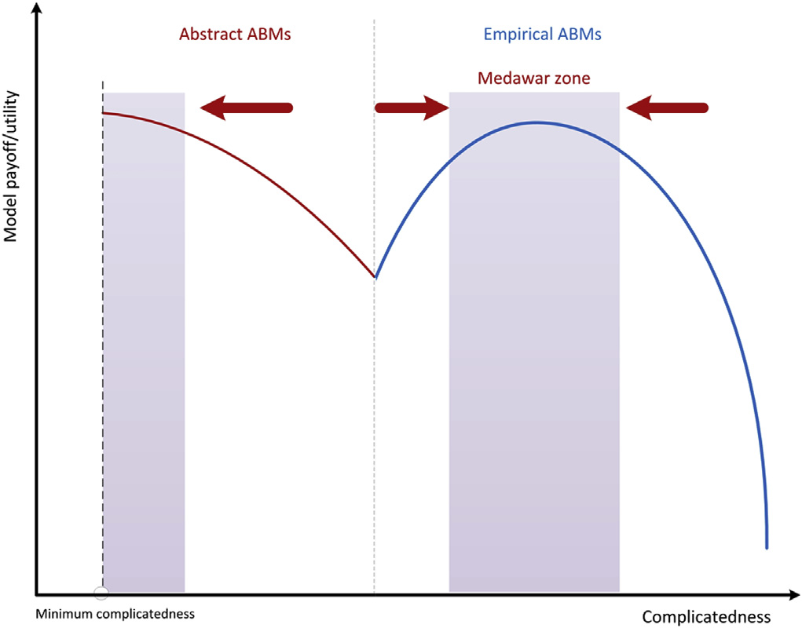{fig-align="center" style="padding-top: 75px;"}
:::
::::

::: footer
(Ilustração de @sun2016[Figure 3], baseada em @grimm2005a[Figure 1])
:::

::: {.notes}
*Simple* [@sun2016; @rand2007] or *abstract* [@sun2016] models *versus* *photograph* [@parker2003], *empirical*, *complicated* [@sun2016], *elaborated and realistic (ER)* [@rand2007] models.

Simple model example: Schelling's segregation model [@schelling1971].

We call this the ‘Medawar zone’ because Medawar described a similar relation between the difficulty of a scientific problem and its payoff [@grimm2005a].
:::

## LogoClim {.smaller}

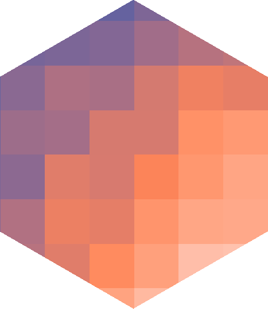{style="height: 5em;"}

[`LogoClim`](https://github.com/sustentarea/logoclim) é um modelo em [NetLogo](https://www.netlogo.org/) desenvolvido para simular e visualizar condições climáticas globais. Ele permite que pesquisadores integrem dados climáticos de alta resolução em modelos baseados em agentes, apoiando pesquisas reprodutíveis em ecologia, agricultura, ciências ambientais e outras áreas que dependem de dados climáticos.

::: {.notes}
:::

## LogoClim {.smaller}

:::: {.columns}
::: {.column style="width: 50%; font-size: 0.75em; padding-top: 0px;"}
{style="width: 15em;"}

O [WorldClim](https://www.worldclim.org/) 2.1 é um projeto de [Stephen E. Fick](https://orcid.org/0000-0002-3548-6966) e [Robert J. Hijmans](https://orcid.org/0000-0001-5872-2872) que fornece dados climáticos globais de alta resolução, como temperatura e precipitação, podendo ser utilizados para mapeamento e modelagem espacial [@fick2017].

O conjunto de dados inclui séries históricas reduzidas em escala (*downscaled*) do [CRU-TS-4.09](https://crudata.uea.ac.uk/cru/data/hrg/cru_ts_4.09/), contendo dados interpolados a partir de milhares de estações meteorológicas, além de projeções futuras reduzidas em escala derivadas dos modelos do Coupled Model Intercomparison Project Phase 6 ([CMIP6](https://wcrp-cmip.org/cmip-phases/cmip6/)).
:::
::: {.column style="width: 50%;"}
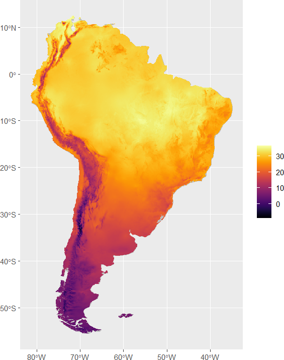{fig-align="center" style="width: 80%; padding-top: 0px;"}
:::
::::

::: {.notes}
:::

## LogoClim {.smaller}

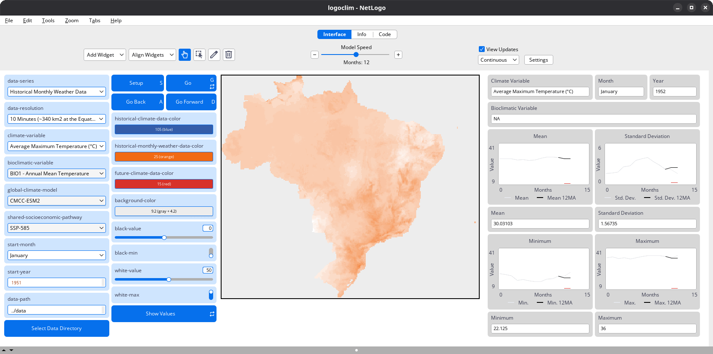{fig-align="center" style="width: 100%; padding-top: 0.75em;"}

::: footer
[@vartanian2025w]
:::

::: {.notes}
:::

## Logônia {.smaller}

[{style="width: 120px;"}](https://github.com/sustentarea/logonia)

[`Logônia`](https://github.com/sustentarea/logonia) é um modelo em [NetLogo](https://www.netlogo.org/) que simula a resposta de crescimento de uma planta fictícia, a logônia, sob diferentes condições climáticas. O modelo utiliza dados climáticos do WorldClim 2.1 e demonstra como integrar o modelo [`LogoClim`](https://github.com/sustentarea/logoclim) por meio da extensão [`LevelSpace`](https://ccl.northwestern.edu/netlogo/docs/ls.html).

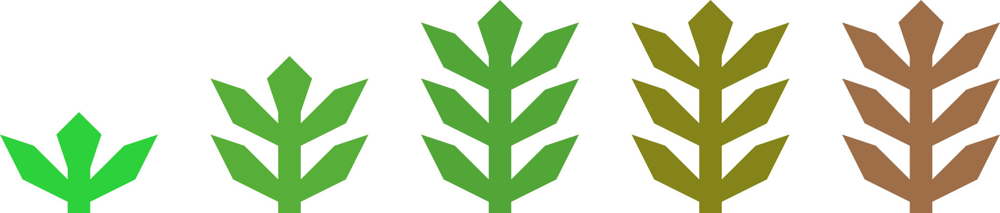{fig-align="center" style="width: 70%; padding-top: 0.5em;"}

::: {.notes}
:::

## Logônia {.smaller}

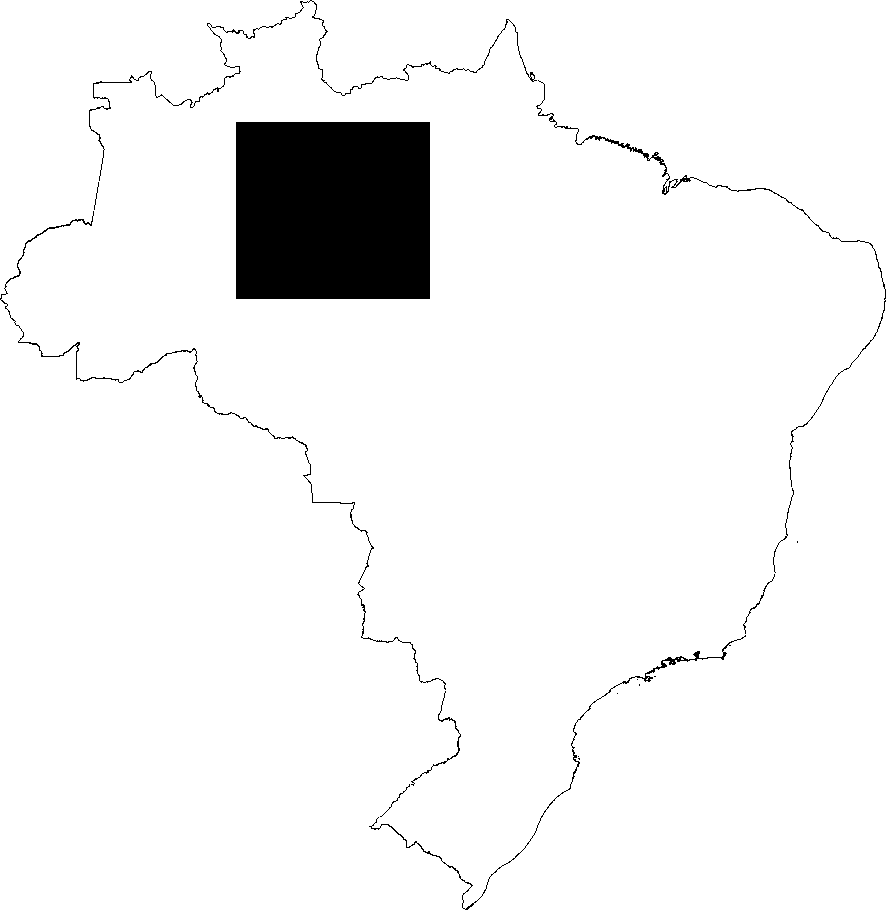{fig-align="center" style="width: 20%;"}

:::: {.columns}
::: {.column style="width: 33%;"}
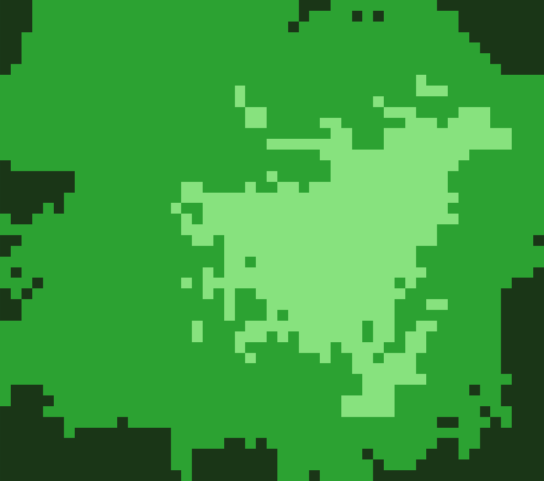{fig-align="right" style="width: 10em;"}
:::
::: {.column style="width: 34%;"}
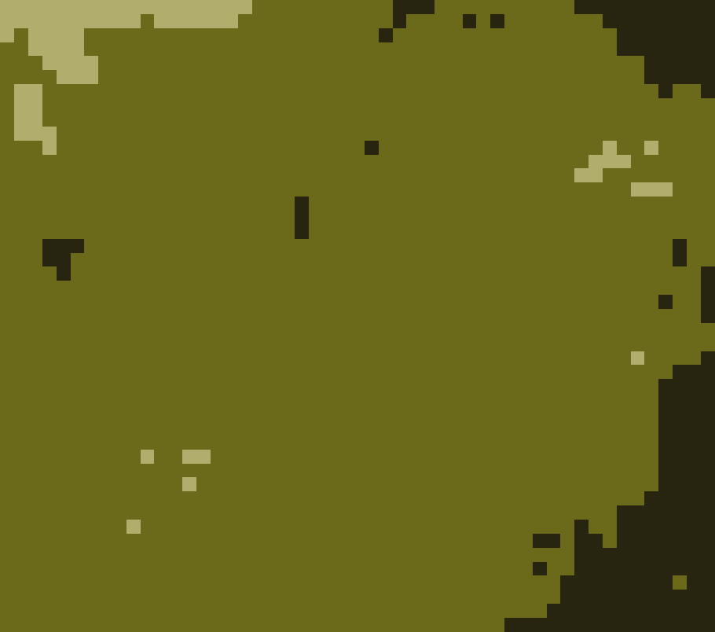{fig-align="center" style="width: 10em;"}
:::
::: {.column style="width: 33%;"}
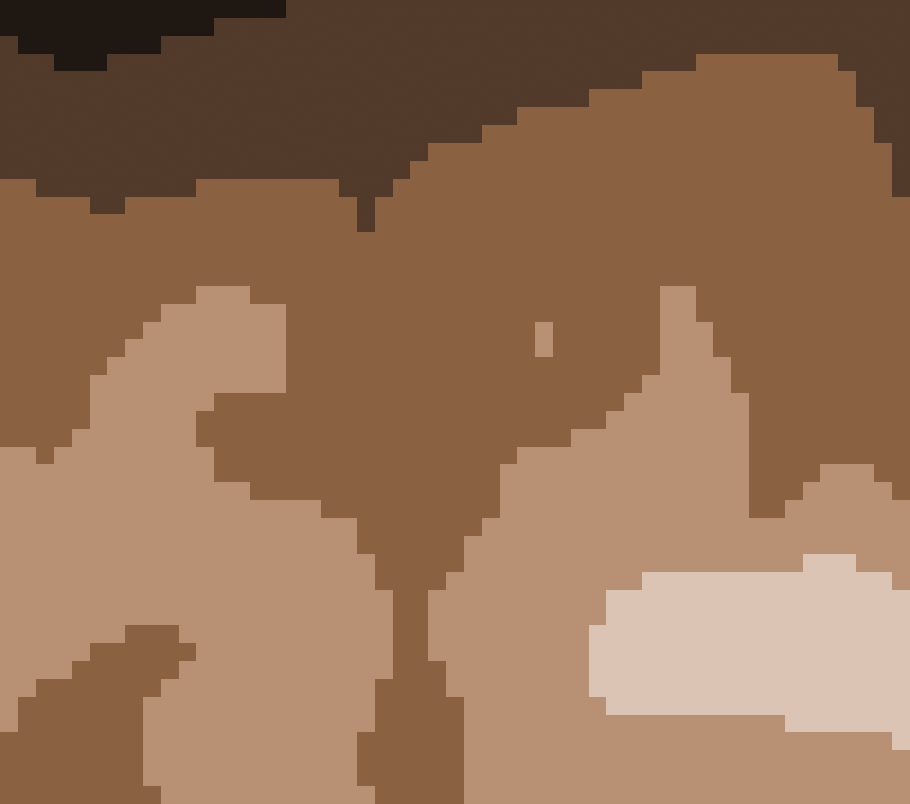{fig-align="left" style="width: 10em;"}
:::
::::

::: {.notes}
:::

## Logônia {.smaller}

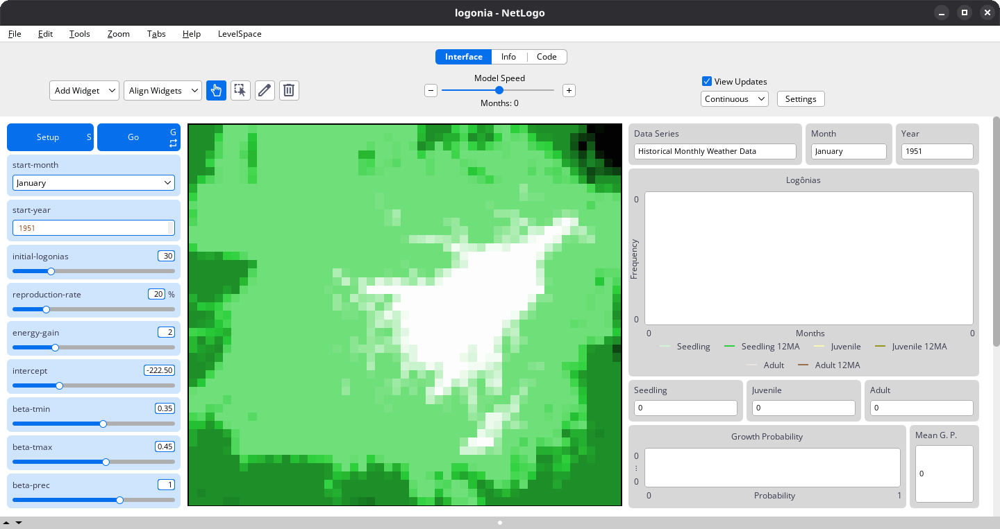{fig-align="center" style="width: 100%; padding-top: 0px; padding-bottom: 0px;"}

::: footer
[@vartanian2025g]
:::

::: {.notes}
:::

## Logônia {.smaller}

:::: {.columns}
::: {.column .center style="width: 50%; padding-top: 0px;"}
Energia e Probabilidade de Crescimento

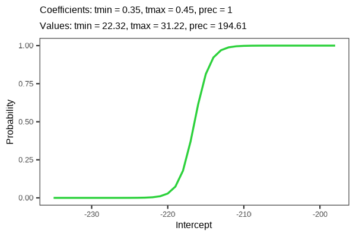{fig-align="center" style="width: 90%;"}
:::
::: {.column style="width: 50%; padding-top: 0px;"}
Fases de Crescimento

{fig-align="center" style="width: 90%;"}

Senescência

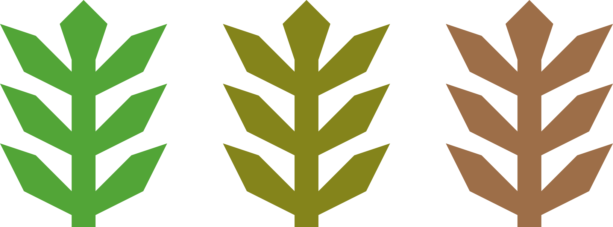{fig-align="center" style="width: 90%;"}
:::
::::

::: footer
[@vartanian2025g]
:::

::: {.notes}
:::

## Logônia {.smaller}

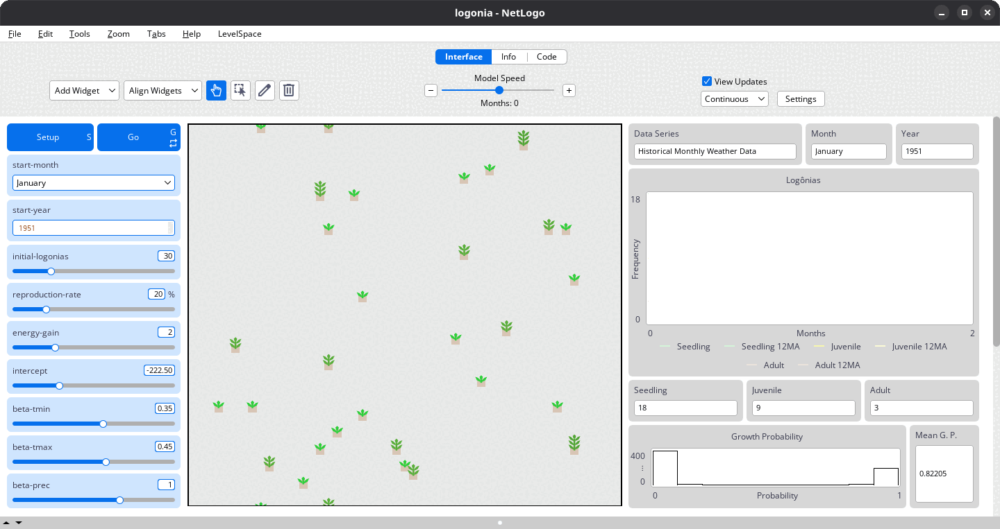{fig-align="center" style="width: 100%; padding-top: 0px; padding-bottom: 0px;"}

::: footer
[@vartanian2025g]
:::

::: {.notes}
:::

## Logônia {.smaller}

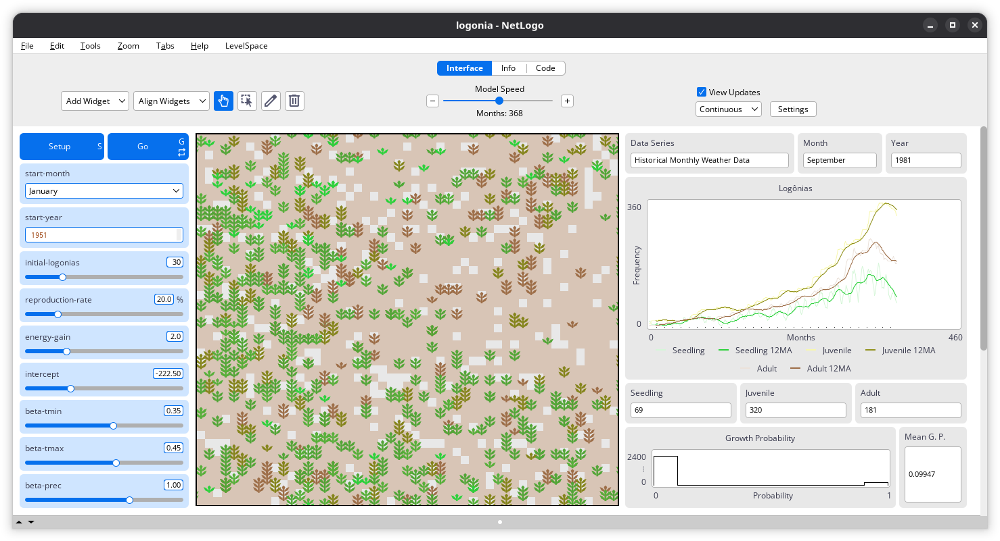{fig-align="center" style="width: 100%; padding-top: 0px; padding-bottom: 0px;"}

::: footer
[@vartanian2025g]
:::

::: {.notes}
:::

## Logônia {.smaller}

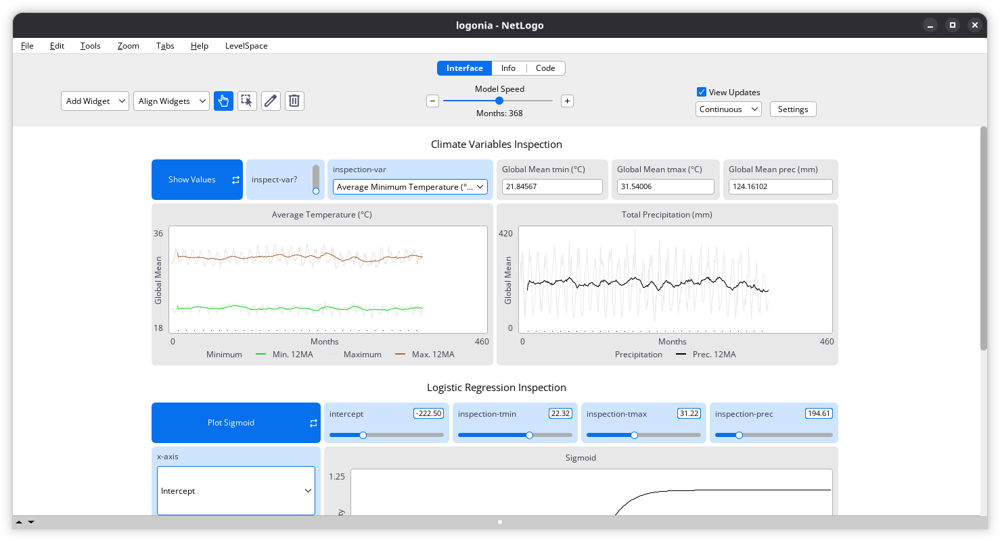{fig-align="center" style="width: 100%; padding-top: 0px; padding-bottom: 0px;"}

::: footer
[@vartanian2025g]
:::

::: {.notes}
:::

## Sindemia Global

:::: {.columns}
::: {.column style="width: 42.5%; text-align: right; font-size: 2em; margin-top: -30px;"}
👁️⃤
:::
::: {.column style="width: 2.5%; margin-top: -15px;"}
:::
::: {.column style="width: 55%; text-align: left; font-size: 0.8em; font-weight: bold; padding-top: 1.25em; margin-top: -15px;"}
Observer
:::
::::

::: {style="padding-top: 5px;"}
:::

::::: {.columns}
:::: {.column style="width: 23.125%; text-align: center; font-size: 0.8em; font-weight: bold;"}
Grid Cells

::: {style="font-size: 2.5em;"}
⊞`<br>`{=html}
🌡️`<br>`{=html}
🌧️
:::
::::
:::: {.column style="width: 2.5%;"}
::::
:::: {.column style="width: 23.125%; text-align: center; font-size: 0.8em; font-weight: bold;"}
Food

::: {style="font-size: 2.5em;"}
🍌🍅`<br>`{=html}
🥬🌾`<br>`{=html}
🥛🥩
:::
::::
:::: {.column style="width: 2.5%;"}
::::
:::: {.column style="width: 23.125%; text-align: center; font-size: 0.8em; font-weight: bold;"}
Families

::: {style="font-size: 2.5em;"}
👨‍👩‍👧`<br>`{=html}
👩‍👩‍👦`<br>`{=html}
👨‍👨‍👧
:::
::::
:::: {.column style="width: 2.5%;"}
::::
:::: {.column style="width: 23.125%; text-align: center; font-size: 0.8em; font-weight: bold;"}
Children

::: {style="font-size: 2.5em;"}
🧒`<br>`{=html}
👧
:::
::::
:::::

::: {.notes}
:::

## Como Saber Mais? {.smaller}

:::: {.columns}
::: {.column style="width: 47.5%;"}
[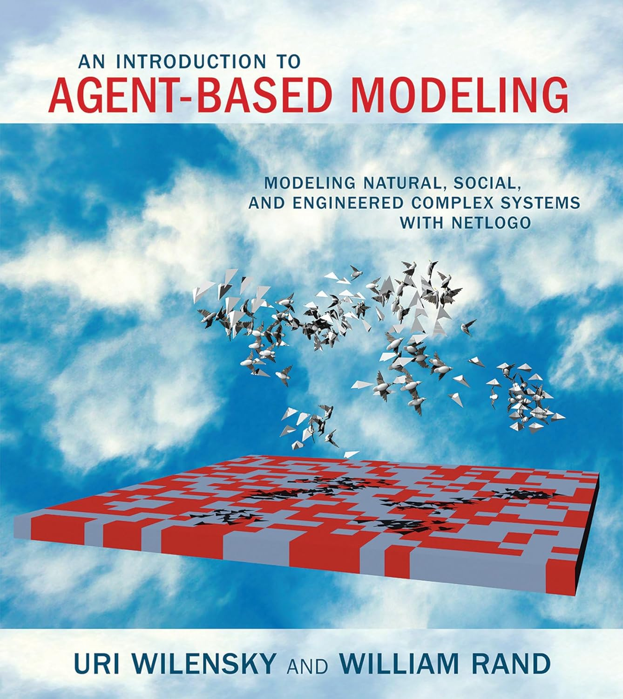{fig-align="center" style="width: 100%; padding-top: 15px;"}](https://mitpress.mit.edu/9780262731898/an-introduction-to-agent-based-modeling/)
:::
::: {.column style="width: 5%;"}
:::
::: {.column style="width: 47.5%;"}
[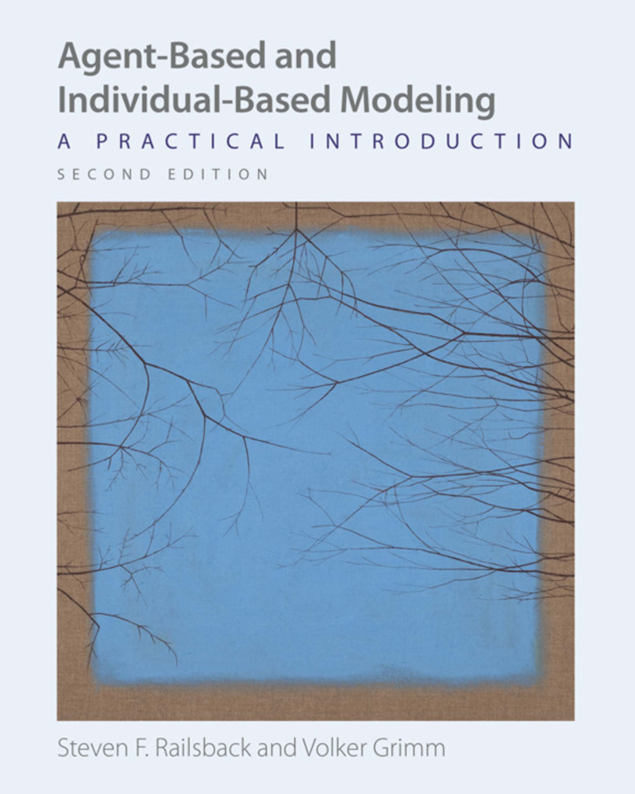{fig-align="center" style="width: 90%;"}](https://www.railsback-grimm-abm-book.com/)
:::
::::

::: footer
(Capa do livro de @wilensky2015 e @railsback2019)
:::

::: {.notes}
:::

## Como Saber Mais? {.smaller}

::::: {.columns}
:::: {.column style="width: 47.5%; padding-top: 3.5em;"}
[{fig-align="center" style="width: 50%; border-radius: 50%;"}](https://abmstudygroup.org)

::: {style="text-align: center; margin-top: -1em;"}
[Grupo de Estudos de Modelagem Baseada em Agentes]{style="font-size: 1em; font-weight: bold;"}
:::
::::
:::: {.column style="width: 5%;"}
::::
:::: {.column style="width: 47.5%; padding-top: 2em;"}
[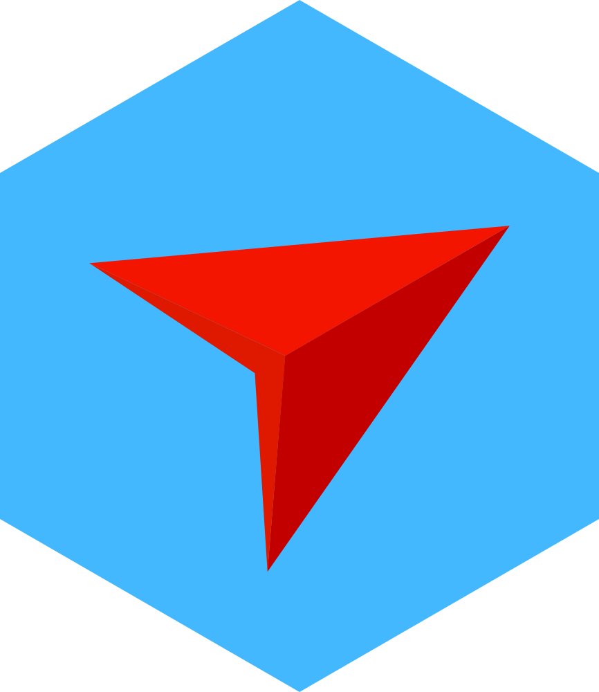{fig-align="center" style="width: 50%;"}](https://danielvartan.github.io/logolink)

::: {style="text-align: center; margin-top: -1em;"}
[`logolink`: Uma Interface para Executar Simulações do NetLogo a Partir do R]{style="font-size: 1em; font-weight: bold;"}
:::
::::
:::::

## Como Saber Mais? {.smaller}

::::: {.columns}
:::: {.column style="width: 47.5%;"}
[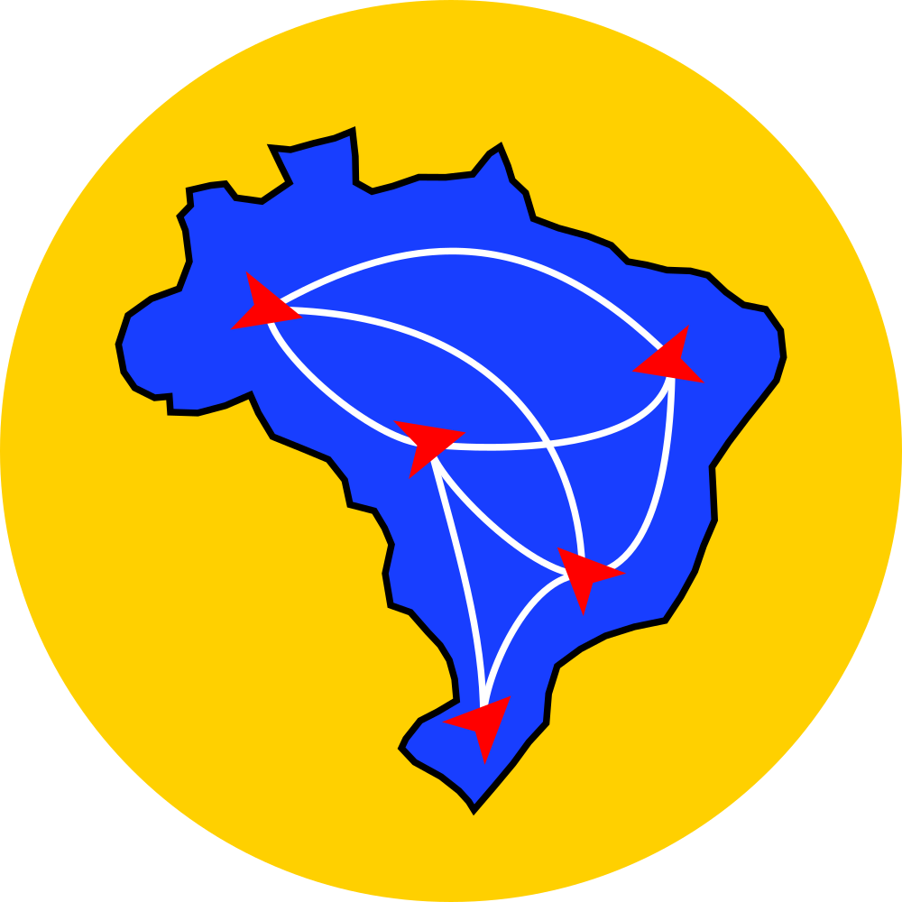{fig-align="center" style="width: 60%; padding-top: 1em;"}](https://simbra.com.br)

::: {style="text-align: center; margin-top: -1.5em; line-height: 1em;"}
[SIMBRA]{style="font-family: Montserrat; font-size: 2em; font-weight: 900;"}

::: {style="margin-top: -0.5em;"}
[1.º Simpósio Interdisciplinar Brasileiro`<br>`{=html} de Modelos Baseados em Agentes]{style="font-family: Montserrat; font-size: 0.75em; font-weight: 500;"}
:::
:::
::::
:::: {.column style="width: 5%;"}
::::
:::: {.column style="width: 47.5%; text-align: center; display: inline-block;"}
**Apoio**

[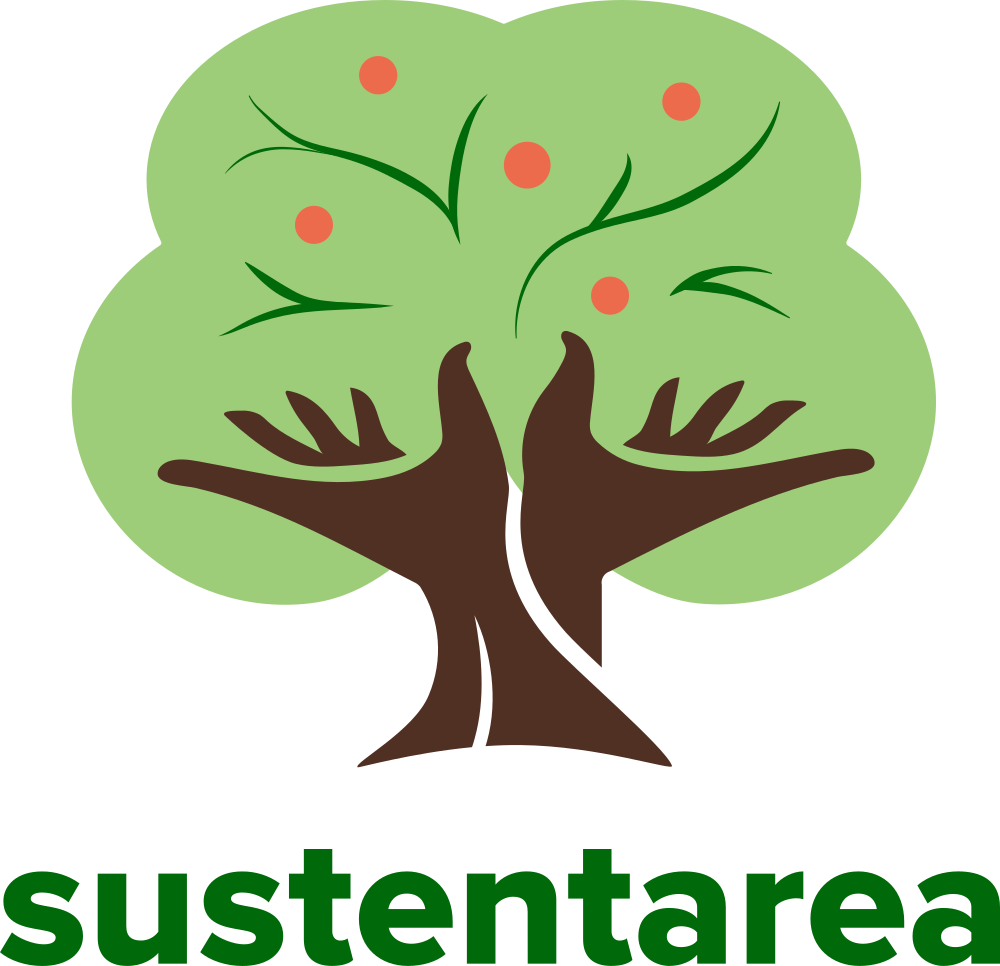{.logo style="width: 3em; margin: 0.25em"}](https://www.fsp.usp.br/sustentarea)
[{.logo style="width: 5em; margin: 0.25em"}](https://www.fsp.usp.br/inct-combate-a-fome)
[{.logo style="width: 3em; margin: 0.25em"}](https://www.fsp.usp.br/)
[{.logo style="width: 5.5em; margin: 0.25em"}](https://www.each.usp.br/)
[{.logo style="width: 3em; margin: 0.25em"}](https://www.each.usp.br/)
[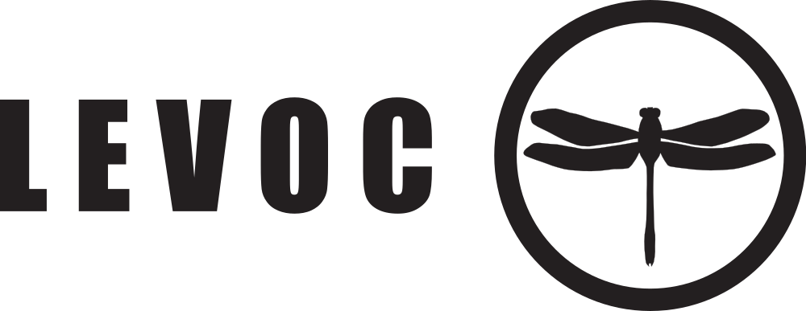{.logo style="width: 5.5em; margin: 0.25em"}](https://mae.usp.br/levoc/)
[{.logo style="width: 3.5em; margin: 0.25em"}](https://www.usp.br/)
[{.logo style="width: 7em; margin: 0.25em"}](https://www.ufpi.br/)
[{.logo style="width: 3em; margin: 0.25em"}](https://resiclima.com.br/)
[{.logo style="width: 5.5em; margin: 0.25em"}](https://www.qub.ac.uk/)
[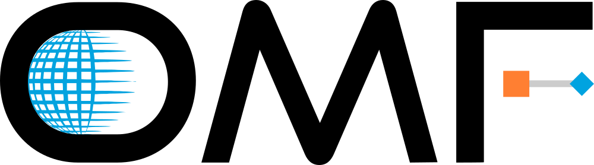{.logo style="width: 4.5em; margin: 0.25em"}](https://www.openmodelingfoundation.org/)
[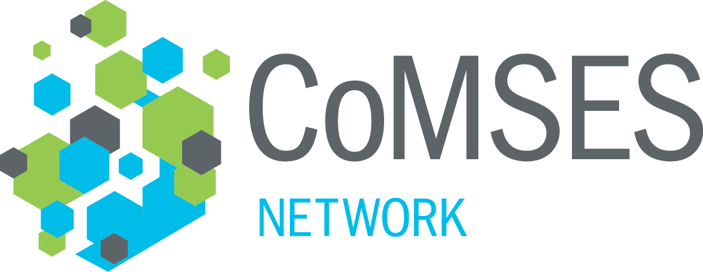{.logo style="width: 7em; margin: 0.25em"}](https://www.comses.net/)
::::
:::::

## Considerações Finais {.smaller}

[{style="width: 12%; padding-top: 0px;"}](https://www.gnu.org/licenses/gpl-3.0)
[{style="width: 19%; padding-top: 0px;"}](https://creativecommons.org/licenses/by/4.0/)

Esta apresentação foi criada com o sistema de publicação [Quarto](https://quarto.org/). O código e os materiais estão disponíveis no [GitHub](https://github.com/danielvartan/resiclima-pres-2).

{fig-align="center" style="width: 80%; padding-top: 50px;"}

::: footer
(Ilustração de [Allison Horst](https://twitter.com/allison_horst))
:::

::: {.notes}
:::

## Referências {.smaller}

::: {style="font-size: 0.75em;"}
De acordo com o Estilo da American Psychological Association ([APA](https://apastyle.apa.org/)), 7ª edição.
:::

::: {#refs style="font-size: 0.75em;"}
:::

::: {.notes}
:::

## Obrigado! {.nostretch}

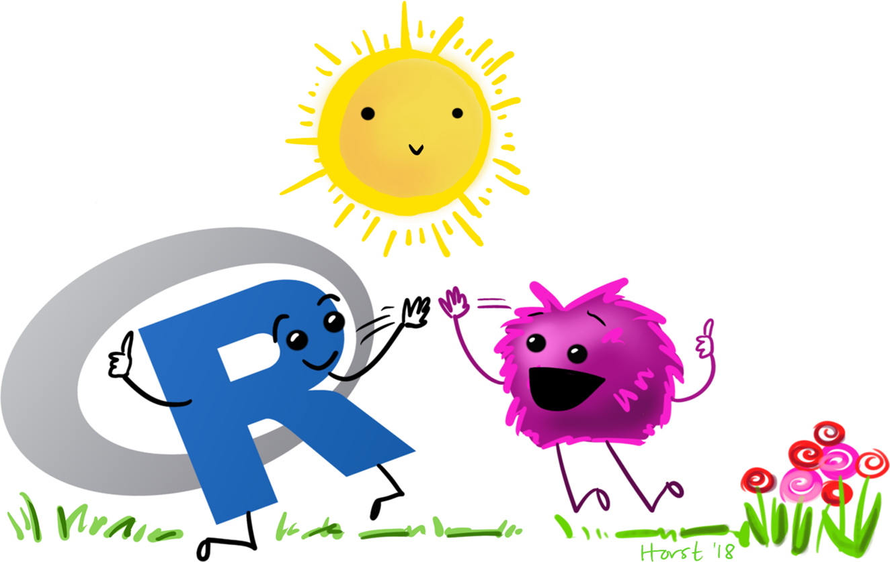{fig-align="center" style="width: 70%; padding-top: 25px;"}

::: footer
(Ilustração de [Allison Horst](https://twitter.com/allison_horst))
:::

::: {.notes}
:::

## {data-menu-title="QR codes" .nostretch}

:::: {.columns}
::: {.column style="width: 50%; text-align: center; padding-top: 20px;"}
[Linktree]{.brand-brown style="font-weight: bold;"}

[{fig-align="center" style="width: 80%; padding-top: 0px;"}](https://linktr.ee/danielvartan)
:::
::: {.column style="width: 50%; text-align: center; padding-top: 20px;"}
[Apresentação]{.brand-brown style="font-weight: bold;"}

[{fig-align="center" style="width: 80%; padding-top: 0px;"}](https://danielvartan.github.io/resiclima-pres-2/)
:::
::::

::: {.notes}
:::
