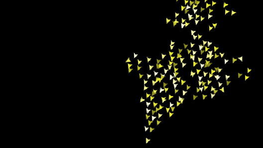
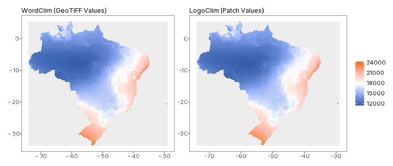
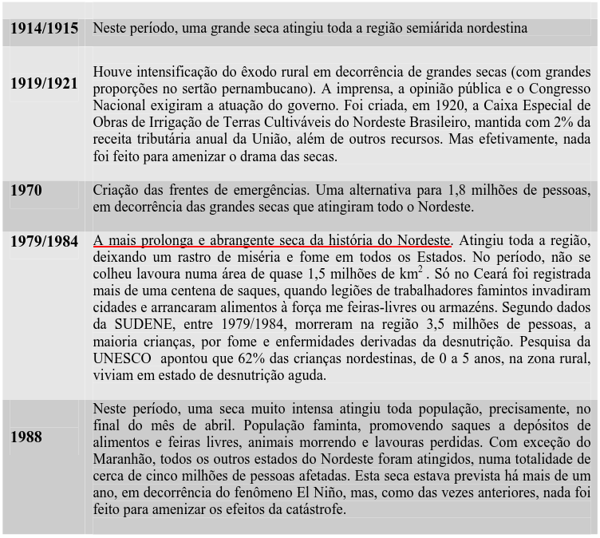

## Hi there! 👋 {.smaller}

```{r}
#| label: setup
#| include: false

library(here)
library(rutils) # github.com/danielvartan/rutils

source(here("R", "_setup.R"))
```

::::: {.columns}
:::: {.column style="width: 55%; font-size: 0.75em;"}
This presentation explores how Agent-Based Models (ABMs) can **integrate multiple perspectives** in modeling complex systems and function as a tool for analyzing the combined impacts of climate change.

::: {style="padding-top: 15px;"}
Here are the main topics:

1. **Agent-Based Models**
1. **LogoClim: WorldClim in NetLogo**
1. **Logônia: An Example Application**
1. **Global Syndemic**
1. **Conclusion**
:::
::::
:::: {.column style="width: 45%; text-align: center"}
{style="width: 55%;"}

{style="width: 65%; margin-top: -25px;"}
::::
:::::

::: {.notes}
:::

## Agent-Based Models {.smaller}

::::: {.columns}
:::: {.column style="width: 47.5%; font-size: 0.725em;"}
Agent-based models (ABMs) are **computational models** with the purpose of simulating the behavior of agents and their interactions, allowing us to study **emergent phenomena**.

Instead of describing a system only with variables representing the state of the whole system (a **global approach**/top-down), we model its individual agents (a **local approach**/bottom-up) [@railsback2019].

Agents often represent people or other animals, but **agents can also represent anything** from biological cells to economic firms to political municipalities [@smaldino2023a].
:::
:::: {.column style="width: 5%;"}
::::
:::: {.column style="width: 47.5%;"}
::: {layout-nrow=2 style="padding-top: 25px"}
{fig-align="center"}

{fig-align="center"}
:::
::::
:::::

::: footer
(Image and video by [Primer](https://www.youtube.com/watch?v=YNMkADpvO4w))
:::

::: {.notes}
:::

## NetLogo {.smaller}

:::: {.columns}
::: {.column .center style="width: 55%; padding-top: 0px;"}
{fig-align="center" style="width: 100%;"}

[{fig-align="center" style="width: 80%; margin-top: -1em"}](https://www.netlogo.org/)
:::
::: {.column style="width: 45%; padding-top: 0px;"}
{fig-align="center" style="width: 90%;"}
:::
::::

::: footer
(Photo by the [MIT Museum](https://mitmuseum.mit.edu/collections/object/GCP-00019361))
:::

::: {.notes}
:::

## Pattern-Oriented Modeling {.smaller}

**A pattern is anything beyond random variation**.

We can think of patterns as regularities, signals.

:::: {.columns}
::: {.column .center style="width: 50%; padding-top: 30px;"}
{fig-align="center" style="width: 90%;"}
:::
::: {.column style="width: 50%; padding-top: 30px;"}
{fig-align="center" style="width: 90%;"}
:::
::::

::: {style="font-size: 0.65em; padding-left: 30px; padding-right: 30px; margin-top: -30px" .brand-gray}
**Alignment**: A bird tends to turn so that it is moving in the same direction that nearby birds are moving.

**Separation**: A bird will turn to avoid another bird which gets too close.

**Cohesion**: A bird will move towards other nearby birds (unless another bird is too close).
:::

::: footer
(Video by [National Geographic](https://www.youtube.com/watch?v=V4f_1_r80RY) | Flocking model by @wilensky1998, based on @reynolds1987)
:::

::: {.notes}
:::

## Examples {.smaller}

:::: {.columns}
::: {.column style="width: 50%; font-size: 0.75em;"}
**Ecology**`<br>`{=html}[Predator-Prey](https://en.wikipedia.org/wiki/Lotka%E2%80%93Volterra_equations) [@lotka1925; @volterra1926]

{fig-align="center" style="width: 90%;"}
:::
::: {.column style="width: 50%; font-size: 0.75em;"}
**Epidemiology**`<br>`{=html}[Epidemic (SIR)](https://en.wikipedia.org/wiki/Compartmental_models_(epidemiology)#SIR_model) [@kermack1927]

{fig-align="center" style="width: 90%;"}
:::
::::

::: footer
(Models developed by @wilensky1997 and @yang2011)
:::

::: {.notes}
:::

## Examples {.smaller}

:::: {.columns}
::: {.column style="width: 50%; font-size: 0.75em;"}
**Physics**`<br>`{=html}[Chladni Figures](https://en.wikipedia.org/wiki/Ernst_Chladni#Chladni_figures)** [@chladni1787]

{fig-align="center" style="width: 90%;"}
:::
::: {.column style="width: 50%; font-size: 0.75em;"}
**Evolutionary Psychology**`<br>`{=html}[Altruism](https://en.wikipedia.org/wiki/Altruism) [@lehmann2006]

{fig-align="center" style="width: 90%;"}
:::
::::

::: {.notes}
:::

::: footer
(Models developed by @brown2025 and @wilensky1998a)
:::

## Examples {.smaller}

:::: {.columns}
::: {.column style="width: 50%; font-size: 0.75em;"}
**Sociology**`<br>`{=html}[Segregation](https://en.wikipedia.org/wiki/Schelling%27s_model_of_segregation) [@schelling1971]

{fig-align="center" style="width: 90%;"}
:::
::: {.column style="width: 50%; font-size: 0.75em;"}
**Environmental Sciences**`<br>`{=html}[Wildfires](https://en.wikipedia.org/wiki/Wildfire)

{fig-align="center" style="width: 90%;"}
:::
::::

::: {.notes}
:::

::: footer
(Models developed by @wilensky1997a and @wilensky1997b)
:::

## Examples {.smaller }

::: {.column style="font-size: 0.75em;"}
[**Generative Agents**](https://en.wikipedia.org/wiki/Generative_artificial_intelligence)
:::

{fig-align="center" style="width: 100%;"}

::: {.notes}
:::

::: footer
(Model developed by @park2023)
:::

## Applications of ABMs {.smaller}

Development and **corroboration** of theories.

**Exploration** of scenarios and leverage points.

**Prediction** of future scenarios (for empirical models only).

::: {.brand-red style="font-weight: bold; text-align: center; padding-top: 1em; padding-bottom: 1em;"}
Given the conditions of your theory, is it possible to [replicate]{.brand-green} the phenomenon and its patterns through an agent-based simulation?
:::

::: {style="font-size: 0.85em;"}
\[...\] they think you're done when you can't add anything more. I think you're done when you can't take anything more out. (Joshua Epstein) [@rutt2020]

A theory which is not refutable by any conceivable event is nonscientific. Irrefutability is not a virtue of a theory (as people often think) but a vice. [@popper2002]
:::

::: {.notes}
:::

## Types of Models {.smaller}

:::: {.columns}
::: {.column style="width: 50%; font-size: 0.85em; padding-top: 0px;"}
**Abstract models** allow for the examination of **general principles** in detail [@rand2007].

**Empirical models** are generally more oriented towards **prediction** and often need to address specific questions posed by policy-makers at particular sites [@sun2016].

**Full spectrum modeling** combines the benefits of abstract and empirical models [@rand2007].
:::

::: {.column style="width: 50%;"}
{fig-align="center" style="padding-top: 75px;"}
:::
::::

::: footer
(Artwork by @sun2016[Figure 3], based on @grimm2005[Figure 1])
:::

::: {.notes}
:::

## LogoClim {.smaller}

[{style="height: 5em;"}](https://github.com/sustentarea/logoclim)

[`LogoClim`](https://github.com/sustentarea/logoclim) is a [NetLogo](https://www.netlogo.org) model for simulating and visualizing global climate conditions. It **allows researchers to integrate high-resolution climate data into agent-based models**, supporting reproducible research in ecology, agriculture, environmental sciences, and other fields that rely on climate data.

::: {.notes}
:::

## LogoClim {.smaller}

:::: {.columns}
::: {.column style="width: 50%; font-size: 0.75em; padding-top: 0px;"}
[{style="width: 15em;"}]((https://www.worldclim.org/))

[WorldClim](https://www.worldclim.org/) 2.1 is a project by [Stephen E. Fick](https://orcid.org/0000-0002-3548-6966) and [Robert J. Hijmans](https://orcid.org/0000-0001-5872-2872) that provides high-resolution global climate data, such as temperature and precipitation, which can be used for spatial mapping and modeling [@fick2017].

The dataset includes historical series downscaled from [**CRU-TS-4.09**](https://crudata.uea.ac.uk/cru/data/hrg/cru_ts_4.09/), containing data interpolated from thousands of weather stations, as well as future downscaled projections derived from models of the Coupled Model Intercomparison Project Phase 6 ([**CMIP6**](https://wcrp-cmip.org/cmip-phases/cmip6/)).

:::
::: {.column style="width: 50%;"}
{fig-align="center" style="width: 80%; padding-top: 0px;"}
:::
::::

::: {.notes}
:::

## LogoClim {.smaller}

:::: {.columns}
::: {.column style="width: 30%; font-size: 0.9em;"}
[**Historical Climate Data**]{.brand-red}

Includes 12 monthly points representing averages from **1970-2000** for temperature, precipitation, solar radiation, wind, vapor pressure, elevation, and [bioclimatic variables](https://www.worldclim.org/data/bioclim.html).
:::
:::: {.column style="width: 5%;"}
::::
::: {.column style="width: 30%; font-size: 0.9em;"}
[**Historical Monthly Weather Data**]{.brand-red}

Includes 12 monthly points per year from **1951 to 2024**, with minimum and maximum temperature and total precipitation, based on [CRU-TS-4.09](https://crudata.uea.ac.uk/cru/data/hrg/cru_ts_4.09/).
:::
:::: {.column style="width: 5%;"}
::::
::: {.column style="width: 30%; font-size: 0.9em;"}
[**Future Climate Data**]{.brand-red}

Includes 12 monthly points from [CMIP6](https://www.wcrp-climate.org/wgcm-cmip/wgcm-cmip6) projections for **2021-2100 (four periods)** and **four** [**SSP scenarios**](https://climatedata.ca/resource/understanding-shared-socio-economic-pathways-ssps/) (126, 245, 370, 585), covering average, maximum, and minimum temperature, precipitation, and [bioclimatic variables](https://www.worldclim.org/data/bioclim.html).
:::
::::

::: {.notes}
:::

## LogoClim {.smaller}

{fig-align="center" style="width: 100%; padding-top: 0.75em;"}

::: footer
[@vartanian2025w]
:::

::: {.notes}
:::

## LogoClim {.smaller}

{fig-align="center" style="width: 100%; padding-top: 1.5em;"}

::: footer
[@vartanian2025w]
:::

::: {.notes}
:::

## Logônia {.smaller}

[{style="width: 120px;"}](https://github.com/sustentarea/logonia)

[`Logônia`](https://github.com/sustentarea/logonia) is a [NetLogo](https://www.netlogo.org) model that simulates the growth response of a fictional plant, logônia, under different climatic conditions. The model uses climate data from [WorldClim 2.1](https://worldclim.org/) and demonstrates how to integrate the [`LogoClim`](https://github.com/sustentarea/logoclim) model through the [`LevelSpace`](https://ccl.northwestern.edu/netlogo/docs/ls.html) extension.

{fig-align="center" style="width: 70%; padding-top: 0.5em;"}

::: {.notes}
:::

## Logônia {.smaller}

{fig-align="center" style="width: 20%;"}

:::: {.columns}
::: {.column style="width: 33%;"}
{fig-align="right" style="width: 10em;"}
:::
::: {.column style="width: 34%;"}
{fig-align="center" style="width: 10em;"}
:::
::: {.column style="width: 33%;"}
{fig-align="left" style="width: 10em;"}
:::
::::

::: {.notes}
:::

## Logônia {.smaller}

{fig-align="center" style="width: 100%; padding-top: 0px; padding-bottom: 0px;"}

::: footer
[@vartanian2025g]
:::

::: {.notes}
:::

## Logônia {.smaller}

:::: {.columns}
::: {.column .center style="width: 50%; padding-top: 0px;"}
Energy and Growth Probability

{style="width: 90%; padding-top: 50px;"}
:::
::: {.column style="width: 50%; padding-top: 0px;"}
Growth Phases & Reproduction

{fig-align="center" style="width: 90%;"}

Senescence

{fig-align="center" style="width: 90%;"}
:::
::::

::: footer
[@vartanian2025g]
:::

::: {.notes}
:::

## Logônia {.smaller}

{fig-align="center" style="width: 100%; padding-top: 0px; padding-bottom: 0px;"}

::: footer
[@vartanian2025g]
:::

::: {.notes}
:::

## Logônia {.smaller}

{fig-align="center" style="width: 100%; padding-top: 0px; padding-bottom: 0px;"}

::: footer
[@vartanian2025g]
:::

::: {.notes}
:::

## Logônia {.smaller}

{fig-align="center" style="width: 100%; padding-top: 0px; padding-bottom: 0px;"}

::: footer
[@vartanian2025g]
:::

::: {.notes}
:::

## Logônia {.smaller}

{fig-align="center" style="width: 100%; padding-top: 0px; padding-bottom: 0px;"}

::: footer
[@silva2013, Table 1]
:::

::: {.notes}
:::

## Global Syndemic

:::: {.columns}
::: {.column style="width: 42.5%; text-align: right; font-size: 2em; margin-top: -30px;"}
👁️⃤
:::
::: {.column style="width: 2.5%; margin-top: -15px;"}
:::
::: {.column style="width: 55%; text-align: left; font-size: 0.8em; font-weight: bold; padding-top: 1.25em; margin-top: -15px;"}
Observer
:::
::::

::: {style="padding-top: 5px;"}
:::

::::: {.columns}
:::: {.column style="width: 23.125%; text-align: center; font-size: 0.8em; font-weight: bold;"}
Grid Cells

::: {style="font-size: 2.5em;"}
⊞`<br>`{=html}
🌡️`<br>`{=html}
🌧️
:::
::::
:::: {.column style="width: 2.5%;"}
::::
:::: {.column style="width: 23.125%; text-align: center; font-size: 0.8em; font-weight: bold;"}
Food

::: {style="font-size: 2.5em;"}
🍌🍅`<br>`{=html}
🥬🌾`<br>`{=html}
🥛🥩
:::
::::
:::: {.column style="width: 2.5%;"}
::::
:::: {.column style="width: 23.125%; text-align: center; font-size: 0.8em; font-weight: bold;"}
Families

::: {style="font-size: 2.5em;"}
👨‍👩‍👧`<br>`{=html}
👩‍👩‍👦`<br>`{=html}
👨‍👨‍👧
:::
::::
:::: {.column style="width: 2.5%;"}
::::
:::: {.column style="width: 23.125%; text-align: center; font-size: 0.8em; font-weight: bold;"}
Children

::: {style="font-size: 2.5em;"}
🧒`<br>`{=html}
👧
:::
::::
:::::

::: {.notes}
:::

## Closing Remarks {.smaller}

[{style="width: 12%; padding-top: 0px;"}](https://www.gnu.org/licenses/gpl-3.0)
[{style="width: 19%; padding-top: 0px;"}](https://creativecommons.org/licenses/by-nc-sa/4.0/deed.en)

This presentation was created with the [Quarto](https://quarto.org/) Publishing System. The code and materials are available on [GitHub](https://github.com/danielvartan/resiclima-pres-2).

{fig-align="center" style="width: 80%; padding-top: 50px;"}

::: footer
(Artwork by [Allison Horst](https://twitter.com/allison_horst))
:::

::: {.notes}
:::

## References {.smaller}

::: {style="font-size: 0.75em;"}
In accordance with the [American Psychological Association (APA) Style](https://apastyle.apa.org/), 7th edition.
:::

::: {#refs style="font-size: 0.75em;"}
:::

::: {.notes}
:::

## Thank you! {.nostretch}

{fig-align="center" style="width: 70%; padding-top: 25px;"}

::: footer
(Artwork by [Allison Horst](https://twitter.com/allison_horst))
:::

::: {.notes}
:::
